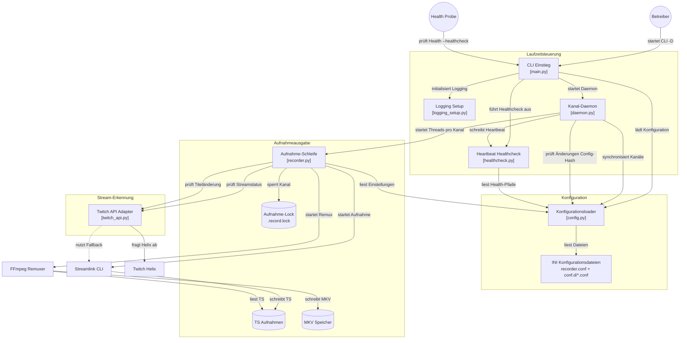

# 🏗️ Architektur

Dieses Dokument beschreibt den Aufbau von `tw-recorder` auf Modulebene: welche Komponente was tut und wie Konfiguration, Streamlink/FFmpeg und die Twitch-Helix-API zusammenspielen. Für Betriebsanleitungen (Docker, `recorder.conf`) siehe [README.md](README.md).

## Überblick

## Komponenten

### Laufzeitsteuerung

- **`main.py`** — argparse-CLI mit genau einem sinnvollen Dauerbetriebs-Modus: `-D`/`--daemon` startet den Kanal-Daemon; `--healthcheck` prüft nur den Heartbeat und beendet sich sofort (für Docker `HEALTHCHECK`, keine Config wird dafür geladen); ohne Flag druckt es nur die Usage. Lädt vor `run_daemon()` einmalig die Konfiguration und initialisiert darüber das Logging.
- **`logging_setup.py`** — richtet das Logging (Konsole/Datei) anhand der geladenen Konfiguration ein.
- **`daemon.py`** — hält pro überwachtem Kanal einen eigenen Thread (`running_threads`, Dict von URL → `(Thread, threading.Event)`). `sync_processes()` vergleicht die aktuell in der Config eingetragenen Kanäle (`parse_streamers()`, Sektion `[channels]`) mit den laufenden Threads: neue Kanäle bekommen einen Thread (`record_loop`), entfernte werden per `stop_event` sauber beendet. `run_daemon()` läuft alle 5s eine Hauptschleife, die per Hash-Vergleich (`config.get_config_hash()`) erkennt, ob sich Config-Dateien geändert haben, und nur dann neu synchronisiert — sonst reines Heartbeat-Schreiben. `SIGINT`/`SIGTERM` stoppen alle Kanal-Threads mit einem gemeinsamen 10s-Zeitbudget (nicht 10s pro Thread), um den Shutdown bei vielen Kanälen nicht unnötig zu verzögern.
- **`healthcheck.py`** — `write_heartbeat()` wird bei jedem Durchlauf der `run_daemon()`-Hauptschleife aufgerufen; `run_healthcheck()` prüft nur Existenz/Alter der Heartbeat-Datei, ohne Config zu laden, damit externe Health-Probes den Prozess nicht belasten.

### Konfiguration

- **`config.py`** — liest `recorder.conf` und alphabetisch sortiert alle `conf.d/*.conf` ein (spätere Dateien überschreiben frühere Werte), mit Fallback auf Environment-Variablen pro Einstellung. `get_config_hash()`/`get_config_files_state()` bilden einen MD5-Hash über alle Config-Dateien — die Grundlage für das Hot-Reload sowohl im Daemon als auch pro Kanal-Thread in `record_loop()` (Config wird dort nur bei tatsächlicher Änderung neu geparst, nicht bei jedem Poll-Tick). `check_secrets_permissions()` warnt (korrigiert aber nicht aktiv, da die Datei meist read-only vom Host gemountet ist), falls `client_secret`/`user_token` im Klartext in einer für Gruppe/Andere lesbaren Datei liegen.

### Stream-Erkennung

- **`twitch_api.py`** — Anbindung an die Twitch-Helix-API: `get_app_access_token()` holt/cached einen App-Access-Token thread-sicher; `check_stream_online()` prüft den Live-Status eines Kanals; `get_stream_info()` liefert zusätzlich Titel/Kategorie für die Split-Erkennung. Ist die Helix-API vorübergehend nicht erreichbar, wird für 60 Sekunden auf einen Streamlink-Fallback (`streamlink --stream-url`) umgeschaltet, statt bei jedem Poll erneut zu scheitern. Fehlen `client_id`/`client_secret`, greift für Nicht-Twitch-URLs bzw. generell derselbe Streamlink-Fallback.

### Aufnahmeausgabe

- **`recorder.py`** — `record_loop()` ist die pro Kanal in einem eigenen Thread laufende Kernschleife: prüft per `twitch_api` den Live-Status, startet bei Bedarf einen `streamlink`-Subprozess (schreibt eine `.ts`-Datei mit Kanal/Kategorie/Titel im Dateinamen), pumpt dessen Ausgabe ins Logging (`_pump_subprocess_output()`, sonst würde sie am Datei-Log vorbeilaufen) und überwacht optional (`split_on_title_change`) per periodischem Helix-Abruf, ob sich Titel oder Kategorie geändert haben — bei einer Änderung wird die laufende Aufnahme sauber beendet und sofort eine neue gestartet, statt bis zum Stream-Ende in einer Datei zu bleiben. Nach Ende eines Aufnahme-Abschnitts remuxt ein `ffmpeg`-Aufruf (`-c copy`, verlustfrei) die `.ts` in eine `.mkv` mit gesetzten Metadaten (Titel, Kommentar, Artist, Datum) und optional gedrosselter I/O-Priorität (`ionice -c3`), bevor die `.ts`-Quelldatei gelöscht wird. Ein `fcntl`-Filelock (`.record.lock` pro Kanalverzeichnis) verhindert parallele Aufnahmen desselben Kanals.

### Dateien & Zustand

- **TS-Aufnahmen** — von Streamlink direkt geschriebene Rohaufnahmen je Kanal-Unterverzeichnis unter `storage_dir`; Dateiname kodiert Zeit, Kanal, Kategorie (in `[...]`) und Titel für das spätere Parsing durch `_parse_recorded_filename()`.
- **MKV-Speicher** — das nach dem Remux verbleibende Endergebnis, benannt nach dem konfigurierbaren `filename_pattern`.
- **Aufnahme-Lock** — `.record.lock`-Datei pro Kanalverzeichnis, verhindert doppelte gleichzeitige Aufnahmen desselben Kanals (z. B. bei zwei Daemon-Instanzen).
- **Heartbeat-Datei** — von `healthcheck.py` geschrieben/gelesen, Grundlage für `--healthcheck` und Docker/Kubernetes-Liveness-Probes.
